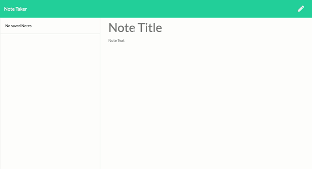

# **Note Taker**
  
  
  ## **Table of Contents**
  * [Contributors](#contributors)
  * [Demo](#demo)
  * [Installation](#installation)
  * [Usage](#usage)
  * [Tests](#tests)
  * [Questions](#questions)
  * [License](#license)
      
      
  ## **Description**
  This web based application is being run on a Heroku server. The application will allow users to input note titles and note body text that will be saved to be able to access and read later on. The user can also delete any and all notes they have created.   

   ## **Contributors**
  * [Robert Anderson](https://github.com/reanderson89)

  * The index.js, styles.css, and html files were provided by
  "© 2019 Trilogy Education Services, a 2U, Inc. brand. All Rights Reserved."
  
  ## **Technology Stack**
  javascript, node.js, express.js, bootstrap
      
  ## **Demo**
  - 
      
  ## **Usage**
  Enter a title and text to the body. Click the save button on the top right of the page to add your note to the sidebar. Click each note in order to see them again from the sidebar. When done with your note click the trash can icon to delete the note.
      
  ## **Questions**   
  ####    **For any questions or inquiries please contact me at,**

  * #### **GitHub:** [@reanderson89](https://github.com/reanderson89)
  * #### **Email:** reanderson89@gmail.com
    
  ## **License**
  MIT
      